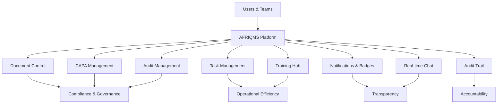
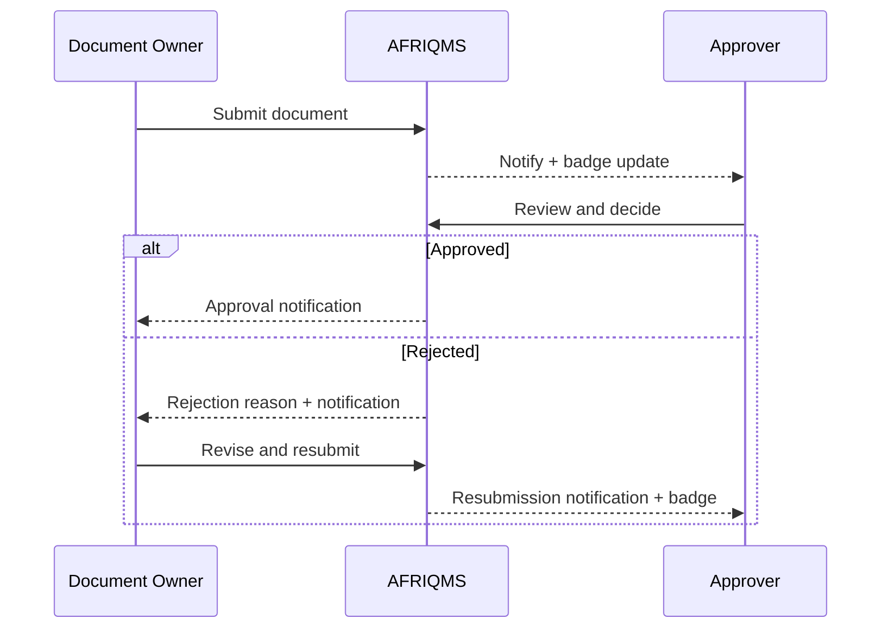
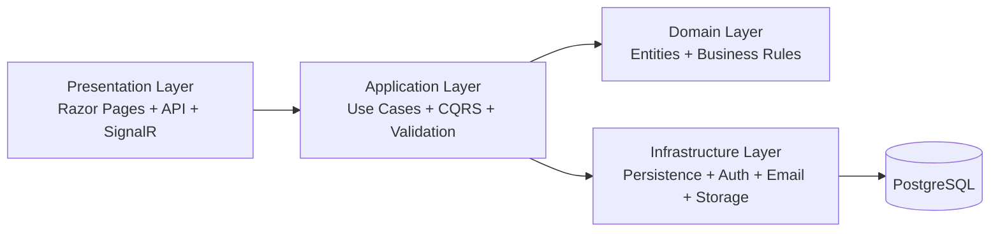

# 🌍 AFRIQMS — Enterprise Quality Management Platform

<div align="center">


</div>

---

## ✨ What is AFRIQMS?

**AFRIQMS** is a full enterprise Quality Management System by **CODAFRIQA** built for organizations that need:

- strong compliance controls,
- operational transparency,
- accountable approvals,
- secure collaboration,
- and continuous quality improvement.

It gives business leaders, quality officers, auditors, managers, and teams one trusted platform to run quality operations from end to end.

---

## 🧭 At a glance (for non-technical stakeholders)

AFRIQMS helps your business:

- 📄 Control quality documents with structured approval workflows.
- ✅ Manage CAPA, audits, and corrective actions with ownership and timelines.
- 🎯 Track tasks, deadlines, and accountability across departments.
- 🎓 Monitor employee training, assessments, and competency history.
- 🔔 Keep everyone updated through badges, notifications, and email alerts.
- 🛡️ Protect data with role-based access, tenant isolation, and security safeguards.
- 🧾 Maintain audit-ready traceability of critical actions.

---

## 🖼️ Platform overview diagram



---

## 💼 Business value

### 1) Compliance confidence
- Controlled workflows for approvals and rejections.
- Clear decision history (who/when/why).
- Audit-ready records for inspections and internal governance.

### 2) End-to-end transparency
- Badge indicators show pending actions.
- In-app + email updates reduce communication gaps.
- Stakeholders get visibility across workflow stages.

### 3) Faster execution
- Centralized action tracking across modules.
- Reduced bottlenecks via role-based ownership.
- Faster turnaround through real-time collaboration.

### 4) Secure multi-client readiness
- Multi-tenant architecture for client-level separation.
- Permission-based access to sensitive operations.
- Scalable base platform ready for customization.

---

## 🧩 Feature modules

### 📄 Document Management
- Create, submit, review, approve, reject, resubmit, and archive controlled documents.
- Visibility of statuses: **Draft / Submitted / In Review / Approved / Rejected**.
- Rejection reasons and latest decision data for transparency.
- Resubmissions route back to approvers with badge/notification updates.

### 🧯 CAPA (Corrective and Preventive Actions)
- Register quality issues and non-conformities.
- Assign action owners, due dates, and follow-up.
- Track lifecycle from initiation to closure.

### 🕵️ Audit Management
- Plan and execute internal/external audits.
- Capture findings and observations.
- Link outcomes to CAPA and tasks for closure discipline.

### ✅ Task Management
- Assign and track quality-related work items.
- Monitor due dates, progress, and approvals.
- Improve execution discipline and follow-through.

### 🎓 Training & Competency Hub
- Schedule, start, complete, and expire training records.
- Role-based trainer/trainee workflows and assessment visibility.
- Trainer remarks, trainee feedback, responses, and competency tracking.
- Archive lifecycle for completed trainings (archive, restore, permanent delete by authorized roles).
- Search/filter support for large training datasets.

### 🔔 Notifications, Badges, and Alerts
- Real-time in-app notifications.
- Badge counters for pending and new activities.
- Email updates for major workflow events.
- Deep-link navigation from notifications to relevant records.

### 💬 Real-time Collaboration
- Team and direct chat channels for context-based communication.
- Faster issue resolution and action alignment.

### 🛂 Roles, Permissions, and Delegation
- Fine-grained permissions per role.
- Hierarchical access patterns for staff, managers, and executives.
- Delegation support for continuity during absence.

### 🧾 Audit Trail & Accountability
- Logs critical user and workflow actions.
- Supports investigations, governance, and evidence reporting.

### 🏢 Multi-Tenancy
- Client-aware data isolation by tenant.
- Shared platform model with isolated business data.
- Built for multiple organizations and customization per client.

---

## 🔄 Example workflow (Document Approval)



---

## 🔐 Security and privacy posture

- 2FA-capable authentication flows.
- Role- and permission-based access checks.
- Rate limiting and secure middleware protection.
- Tenant-level data separation.
- Controlled visibility of sensitive workflow content.

> Production best practice: enforce HTTPS, use strong secrets, secure SMTP credentials, and monitor logs centrally.

---

## 🎛️ Customization options for client deployments

AFRIQMS can be tailored per client preferences:

- approval hierarchies and escalation patterns,
- role and permission matrix,
- organization structure and reporting lines,
- notification behavior and communication rules,
- branding and UI elements,
- compliance/reporting expectations by industry.

---

## 🏗️ Architecture snapshot



---

## 🛠️ Technology stack

- .NET 8.0 / ASP.NET Core
- PostgreSQL 16 + EF Core 8
- SignalR (real-time)
- Tailwind CSS
- JWT + Cookie hybrid authentication
- Docker-ready deployment

---

## 🚀 Quick start (Docker)

```bash
# 1) Clone repository
git clone <repo-url> && cd src

# 2) Create environment config
cp .env.example .env
# Edit .env with real values (DB, JWT secret, SMTP, etc.)

# 3) Generate secure JWT secret
openssl rand -base64 48

# 4) Start services
docker compose up -d

# 5) Open app
open http://localhost:8080
```

The platform will automatically:
- create database resources,
- apply migrations,
- seed default tenant/roles/org structure/sample users.

---

## 🔑 Default login (seeded)

| Role | Email | Password |
|------|-------|----------|
| System Admin | sysadmin@kasah.com | P@ssw0rd! |
| TMD | tmd@kasah.com | P@ssw0rd! |

> Change seeded credentials immediately after first login.

---

## 👨‍💻 Development setup

```bash
# Prerequisites: .NET 8 SDK + PostgreSQL
createdb kasah_qms

# Configure appsettings.Development.json

cd Presentation/<WebProject>
dotnet run
```

Default local URL: `http://localhost:5002`

---

## 📁 Project structure

```text
src/
├── Core/
│   ├── Domain
│   └── Application
├── Infrastructure/
│   ├── Infrastructure
│   └── Infrastructure.Persistence
├── Presentation/
│   ├── Web
│   └── Api
├── Dockerfile
├── docker-compose.yml
└── Solution.sln
```

---

## 🌐 Deployment summary (VPS)

```bash
ssh user@your-server
curl -fsSL https://get.docker.com | sh
git clone <repo-url> && cd src
cp .env.example .env
nano .env
docker compose up -d
```

Health check:

```http
GET /health
```

---

## 📜 Ownership & license

**Product Name:** AFRIQMS  
**Product Owner:** CODAFRIQA  
**License:** Proprietary software
